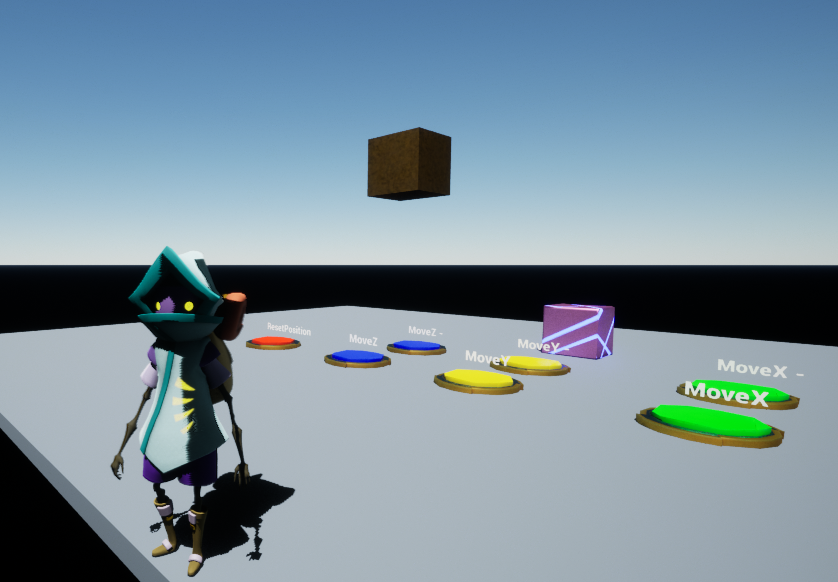

Small project to learn Unreal Engine 5.

The map `TestLevel` was made after the completion of the first part of the tutorial [Welcome to Unreal Engine - First hour in Unreal Engine 4](https://learn.unrealengine.com/course/3756115/module/7278382?moduletoken=UHxxnDLPW8Te7OHdKyu3rbP~WFIQk~CSI0d8PO6zjGjk9A1mTgvkRqBOX4LZBKBu&LPId=119021).

The goal of the level is to move the pink block to the gold block using some buttons.

